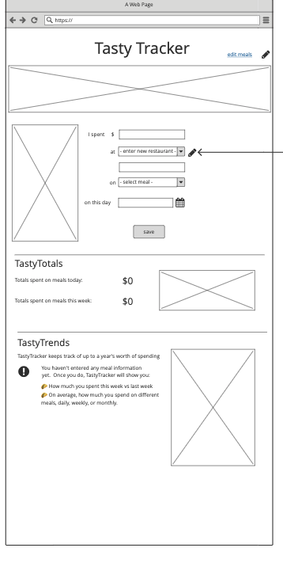
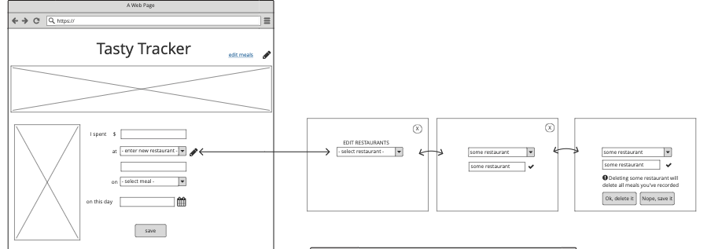

## User Story

"Jon" has been working on developing better relationship to the ways they spend money.  They know that one of the biggest expenses they have is their food expenses from eating out; getting lunch at the local bodega, ordering dinner from the Indian restaurant across the street... a lot.  "Jon" likes the idea of being able to track spending in a simple app to keep that in perspective.

## Target Demographic

Single working class individuals in their 20's to early 40's.

## Research Methodology
### Goal:
Understand how people track their food expenses and how/if their current existing tools meet or fall short of their needs.
### Sample Questionnaire:
1. How often do you buy something outside your home (including purchases such as coffee/tea, midday snacks and the like)?
2. How do you currently track what you spend on those expenses?
3. Where is the system you use most helpful?
4. What goals, if any, have you set in terms of tracking these costs, and has your current system helped you do that?
5. If you use another method or tool to track spending in other facets of your life, what are you using/doing and why don't you use it to track meal costs?

## Sample Group
*in this hypothetical exercise we are going to keep it somewhat simple and assume the survey yields some result that we would break down into a more specific user profile*

## Aggregate Findings

- Our particpants wanted to keep an eye on their spending but didn't have a lot of consistency.  
- They were motivated by finances and other reasons which were reminders to keep them on task.
- Bank statements/credit card staetments and banking software made viewing and tracking expenses easier
- Participants had different systems but acknowledged that it was lacking.
- Goal setting was a useful practice but typically the goals were shorter term in scope rather than longer term.
- a few participants expresed a need for trend analysis
- several participants were more "seat-of-the-pants" budgeters; tracking spending was important but wasn't at the top of their mind.

# Wireframing
 
  
   

